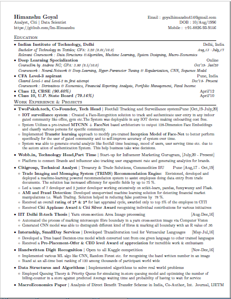

## Reference 
this Repo has taken most of it from this link: 
[Original Repo Link](https://github.com/sb2nov/resume)
There are some extra feature and function I have added according to my requirement otherwise all the things are same.

## original Description
A single-page, one-column resume for software developers. It uses the base latex templates and fonts to provide ease of use and installation when trying to update the resume. The different sections are clearly documented and custom commands are used to provide consistent formatting. The three main sections in the resume are education, experience, and projects.

### Preview

### License
Format is MIT but all the original content and code is owned by [Sourabh Bajaj](https://github.com/sb2nov/resume)
